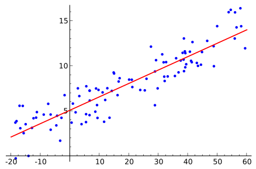
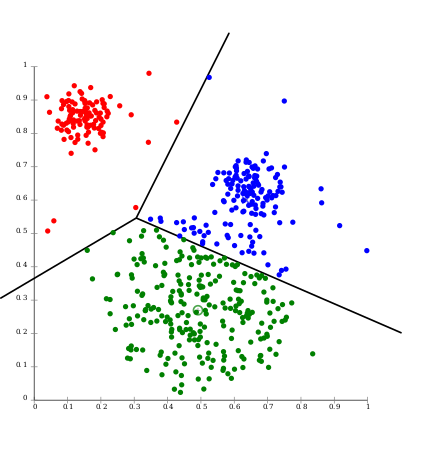
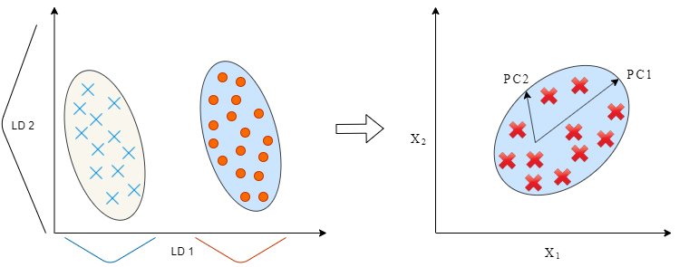
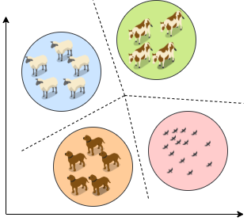

# Machine Learning Techniques

This repository contains different types of Machine Learning implementations made throughout my years at the University.

## About data sets

The data sets have been collected from different platforms, such as:

* [Kaggle](https://www.kaggle.com/)
* [Clustering basic benchmark](http://cs.joensuu.fi/sipu/datasets/)
* [UC Irvine Machine Learning Repository](https://archive.ics.uci.edu/ml/index.php)

## Types of Machine Learning

Machine learning develops algorithms that enable machines to learn on their own and answer certain questions with a high level of certainty and reliability. To develop these algorithms, there are two modalities: _supervised_ and _unsupervised_ learning.

### Supervised learning

Supervised learning algorithms receive a set of inputs (data) along with corresponding results (labels), and this algorithm learns by comparing the results of the output against the actual results (contained in the labels) to find the errors.

According to _[1]_: "_The goal is to make accurate predictions for new and never-before-seen data_".

There are two main types of Supervised Learning problems, which are:

* Regression problems.

* Classification problems.

### Unsupervised learning

According to _[1]_: "_In unsupervised learning, the learning algorithm only displays the input data and is asked to extract the knowledge from this data_".

Unsupervised learning algorithms are presented when the correct output that would be obtained by applying a learning algorithm to the available data set is unknown, therefore, this algorithm must discover what it wants to show.

There are two main types of unsupervised learning, which are:

* Dataset transformations.

* Clustering.

## Other Machine Learning Methods

Two of the widely adopted machine learning methods are _supervised learning_ and _unsupervised learning_ - but there are other methods as well:

* Semi-supervised learning.
* Reinforcement learning.

## Bibliography 

1. Müller, A. C., & Guido, S. (2016). Introduction to machine learning with Python: a guide for data scientists. " O'Reilly Media, Inc.".

